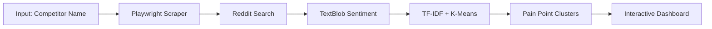

# 🔍 Churn Scout - Market Intelligence Agent

> **Autonomous AI agent that reveals why customers are leaving your competitors**

[](https://apify.com/store)
[](https://python.org)
[](https://scikit-learn.org)

---

## 🎯 What is Churn Scout?

Churn Scout is an **autonomous market intelligence agent** designed for **SaaS founders and marketing teams**. It automatically identifies why customers are leaving a competitor by analyzing public sentiment signals.

Unlike traditional scrapers that simply dump raw text, Churn Scout uses an internal **Machine Learning Engine** to cluster thousands of complaints into specific **Pain Points** (e.g., "Pricing is too high," "Mobile app crashes").

### ✨ Key Features

| Feature | Description |
|---------|-------------|
| 🤖 **Zero API Keys** | No OpenAI, no Gemini, no external AI costs |
| 🧠 **ML-Powered Analysis** | Scikit-Learn clusters complaints into actionable topics |
| 📊 **Beautiful Dashboard** | Self-contained HTML report with interactive insights |
| 🔒 **Privacy-First** | Aggregates data, never stores PII |
| ⚡ **Fast Insights** | Get competitor intelligence in minutes |

---

## 🚀 How It Works



1. **Visual Scraping**: Playwright navigates public Reddit search to find complaints
2. **Sentiment Filtering**: TextBlob filters for negative sentiment (churn signals)
3. **AI Clustering**: Scikit-Learn groups similar complaints into topics
4. **Smart Reporting**: Generates a hosted HTML dashboard with actionable insights

---

## 📥 Input Configuration

| Field | Type | Description | Default |
|-------|------|-------------|---------|
| `competitorName` | String | The brand to analyze (e.g., "Notion", "Jira") | Required |
| `maxPosts` | Integer | Sample size (50-500). Higher = more accurate | 100 |
| `proxyConfiguration` | Object | Apify Proxy settings | Enabled |

### Example Input

```json
{
    "competitorName": "Slack",
    "maxPosts": 200,
    "proxyConfiguration": { "useApifyProxy": true }
}
```

---

## 📤 Output

### 1. Interactive Dashboard (HTML)

A beautiful, self-contained dashboard stored in the Key-Value Store:

- 📊 **Churn Signal Count** - Total negative mentions found
- 📉 **Average Sentiment** - Overall negativity score
- 🏷️ **Pain Point Clusters** - AI-identified complaint categories
- 📝 **Raw Evidence** - Original posts with source links

### 2. Structured Dataset (JSON)

```json
[
    {
        "text": "Slack's pricing is ridiculous for small teams",
        "topic": "ISSUE: PRICING, EXPENSIVE, TEAMS",
        "polarity": -0.42,
        "url": "https://reddit.com/r/..."
    }
]
```

---

## 🛠️ Technology Stack

| Layer | Technology | Purpose |
|-------|------------|---------|
| **Scraping** | Playwright | Visual browser automation |
| **NLP** | TextBlob | Sentiment polarity analysis |
| **ML** | Scikit-Learn | TF-IDF + K-Means clustering |
| **Templating** | Jinja2 | Dashboard generation |
| **Infrastructure** | Docker + Apify | Serverless execution |

---

## 💼 Use Cases

- 🎯 **Competitive Intelligence** - Understand competitor weaknesses
- 📢 **Marketing Strategy** - Craft messaging that addresses pain points
- 🛠️ **Product Development** - Build features competitors lack
- 📈 **Sales Enablement** - Arm sales team with competitor objections

---

## 📋 Compliance & Ethics

✅ **Rate Limited** - Mimics human browsing speed  
✅ **Public Data Only** - Only accesses reddit.com/search  
✅ **No PII** - Aggregates into clusters, no individual targeting  
✅ **Transformative** - Produces insights, not raw data dumps  

---

## 💰 Pricing

| Model | Price |
|-------|-------|
| **Recurring Rental** | $20/month |
| **Pay-Per-Run** | $0.50/run |

---

## 🤝 Support

- 📧 Issues? Open a ticket on Apify
- ⭐ Love it? Leave a review!

---

<div align="center">

**Built with ❤️ for the Apify Store**

*Zero API Keys • Pure Machine Learning • Actionable Intelligence*

</div>
