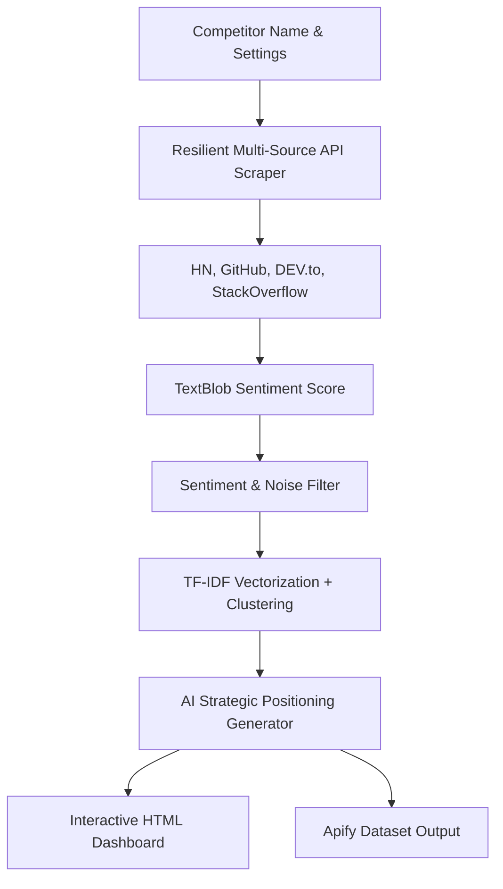

# 🔍 Churn Scout - Market Intelligence Agent

> **Autonomous AI-powered market intelligence agent that reveals why customers are leaving your competitors**

[](https://apify.com/store)
[](https://python.org)
[](https://scikit-learn.org)

---

## 🎯 What is Churn Scout?

Churn Scout is an **autonomous market intelligence agent** designed for **SaaS founders, product managers, and marketing teams**. It automatically crawls multiple public developer and social channels (Hacker News, GitHub Issues, DEV.to, StackOverflow) to identify customer frustrations and churn signals about a target competitor.

Unlike basic text-dumps, Churn Scout utilizes an internal **Machine Learning Engine** (Sentiment Analysis + TF-IDF Vectorization + K-Means Clustering) to group complaints into specific **Pain Point Categories** (e.g., "Pricing Issues", "Performance Problems"). It compiles these signals into a **premium, self-contained, interactive HTML dashboard** containing visualized metrics, client-side filters, and strategic competitor positioning plans.

---

## ✨ Features

### 🎛️ Advanced Target Crawling
- **Multi-Source Support**: Scrape Hacker News, GitHub Issues, DEV.to, and StackOverflow concurrently.
- **Custom Keywords**: Append custom search phrases to look for specific complaints (e.g. "slow", "bug", "pricing").
- **Resilient Architecture**: Automatic retries and exponential backoff handling rate limits gracefully.

### 🧠 Intelligent Processing
- **Sentiment Filtering**: Automatically filters out noise to target high-frustration indicators (polarity below a user-defined threshold).
- **Automated Categorization**: Uses statistical NLP to cluster evidence into clear pain areas.
- **AI Strategic Insights**: Add your API key (Gemini, OpenAI, or OpenRouter) to generate executive summaries, tactical roadmaps, and competitive pitches.

### 📊 Premium Visual Dashboard
- **Modern Aesthetics**: Built with a sleek dark-mode glassmorphic theme inspired by Stripe and Vercel dashboards.
- **Interactive Visualizations**: Embedded Chart.js charts showing sentiment split and category frequency.
- **Client-Side Search & Filters**: Live search over signal text and tabs to filter by platform or severity.
- **Data Portability**: Clean export buttons to download filtered datasets directly to CSV or JSON.

---

## 🚀 How It Works


```mermaid
graph TD
    Input[Competitor Name & Settings] --> Scraper[Resilient Multi-Source API Scraper]
    Scraper --> Sources[HN, GitHub, DEV.to, StackOverflow]
    Sources --> Sentiment[TextBlob Sentiment Score]
    Sentiment --> Filter[Sentiment & Noise Filter]
    Filter --> ML[TF-IDF Vectorization + Clustering]
    ML --> AI[AI Strategic Positioning Generator]
    AI --> Dashboard[Interactive HTML Dashboard]
    AI --> Dataset[Apify Dataset Output]
```

---

## 📥 Input Configuration

| Field | Type | Description | Default |
|-------|------|-------------|---------|
| `competitorName` | String | Target brand/product to analyze (e.g., `Zomato`, `Jira`, `Notion`) | *Required* |
| `maxPosts` | Integer | Total signal sample size limit (50 - 500) | `100` |
| `sources` | Array | Select platforms to scrape (`Hacker News`, `GitHub Issues`, `DEV.to`, `StackOverflow`) | *All selected* |
| `minSentiment` | Number | Maximum sentiment score allowed (`-1.0` to `0.0`). Below `-0.05` filters out neutral comments. | `-0.05` |
| `customKeywords` | String | Comma-separated list of custom words to include in search queries (e.g. `latency, pricing`) | `""` |
| `apiKey` | String | Optional secret key for Gemini, OpenAI, or OpenRouter to unlock Strategic Insights | `""` |
| `proxyConfiguration` | Object | Apify proxy settings to prevent request throttling | `{"useApifyProxy": true}` |

### Example Input

```json
{
    "competitorName": "Slack",
    "maxPosts": 150,
    "sources": ["Hacker News", "GitHub Issues"],
    "minSentiment": -0.1,
    "customKeywords": "expensive, mobile app",
    "apiKey": "YOUR_GEMINI_OR_OPENAI_API_KEY",
    "proxyConfiguration": {
        "useApifyProxy": true
    }
}
```

---

## 📤 Output

### 1. Interactive Dashboard (HTML)
Stored in the default Key-Value Store under the key `OUTPUT`. Contains:
- **KPI Metrics**: Churn signal counts, Average Sentiment, Disruption vulnerability level.
- **Visual Analytics**: Interactive bar charts (pain point frequencies) and doughnut charts (sentiment distribution).
- **Tactical Strategy**: Positioning advice, immediate marketing options, and product differentiation opportunities.
- **Raw Evidence Table**: Filterable, searchable, and sortable table of all scraped complaints.

### 2. Dataset Records (JSON / CSV)
Includes structured metadata for every signal:
- `topic`: Clustered pain point category.
- `text`: Raw complaint text.
- `polarity`: Raw sentiment polarity (-1.0 to 1.0).
- `source`: The source site.
- `date`: Scrape item publishing date.
- `engagement`: Points, comments, or reaction count.
- `url`: Link directly to the community thread.

---

## 🛠️ Technology Stack

- **NLP**: TextBlob Polarity Scoring
- **Machine Learning**: Scikit-Learn (TF-IDF Vectorizer, K-Means Clustering)
- **Engine**: Python 3.11 + Apify SDK
- **Visualization**: Jinja2 Templates, Chart.js, Lucide Icons

---

## 🔒 Compliance & Safe Harbor Guidelines

This Actor is built to operate under strict compliance criteria:
- **Public Data Only**: Accesses public APIs and indexing paths without logging in.
- **Rate Limit Adherence**: Employs query limits and backoff pauses to protect target servers.
- **Privacy-First**: Focuses purely on product critique; strips PII and user-specific details.
- **Transformative Utility**: Creates high-level aggregated strategic business intelligence.
